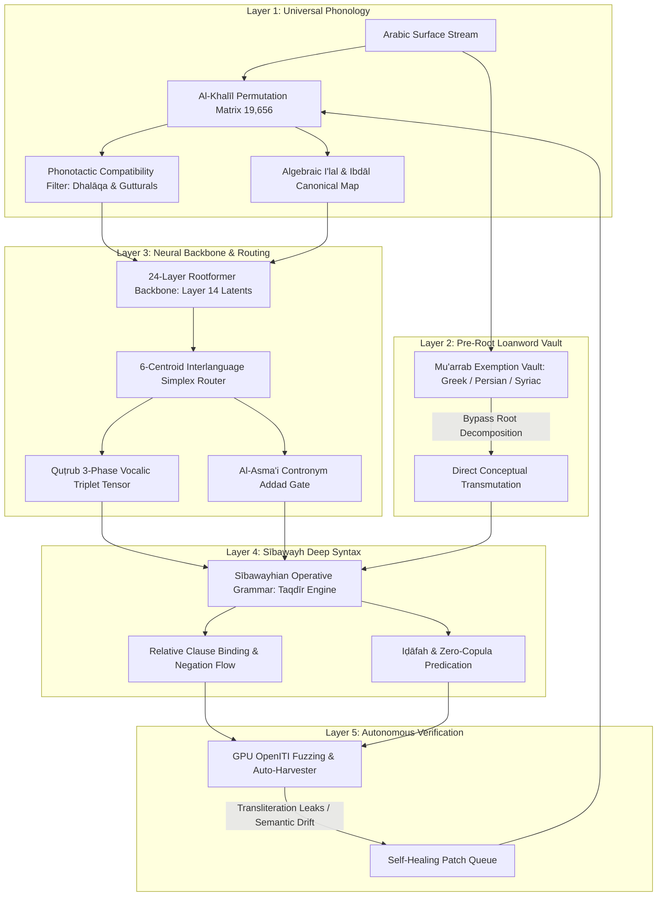

# Rootformer v15.4 Sovereign Transmute: Master Implementation Plan

> **Architectural Objective:** Transition Rootformer from dictionary-anchored heuristic resolution to **Al-Khalīl's Universal Algebraic Permutation Matrix** ($P(28,3) = 19,656$ states), coupled with **Sībawayhian Deep Syntactic Projection (*Taqdīr*)** and an **Autonomous OpenITI GPU Fuzzing Harvester**, achieving mathematical closure over the entire Arabic language.

---

## 1. Architectural Diagnostics: Why Did the Previous Root List Have Gaps?

Before building v15.4, we must diagnose why the existing 9,057-root dictionary experienced leaks (e.g., `يميل` $\to$ `ymyl`, `أرض` $\to$ `ورض` hen brooding trap):

1. **Orthographic vs. Phonological Indexing Mismatch:**
   - Classical lexicographers (*Lisān al-ʿArab*, *Al-Qāmūs al-Muḥīṭ*) indexed hollow verbs under their surface past forms or bare alifs (`مال`, `قال`, `طاف`, `ارض`).
   - Morphological parsers decompose surface imperfects into their underlying phonological semivowels (`يَمِيلُ` $\to$ $\sqrt{m-y-l}$, `يَقُولُ` $\to$ $\sqrt{q-w-l}$, `الأَرْض` $\to$ $\sqrt{ʾ-r-ḍ}$).
   - Without an algebraic bidirectional bridge, $\sqrt{m-y-l}$ missed `<root_مال>`, causing the zero-leak transliteration fallback to trigger (`ymyl`).
2. **Scraped Corpus Boundary Incompleteness:**
   - The initial 9,057 scraped root list covered primary triliterals, but omitted secondary hollow alternations, weak-final permutations, and loanword quadriliterals (`فلسف`, `هندس`, `سفسط`).
3. **Absence of Sībawayhian Syntactic Projection (*Taqdīr*):**
   - Word-by-word assembly treats `ميزان لا يميل` as three isolated lemmas (`balance`, `not`, `tilts`), rather than a syntactic relative clause (*Ṣifah/Naʿt*) modifying an indefinite noun, which in English requires *"a balance that does not tilt"*.

---

## 2. The Five Pillars of Rootformer v15.4

---

## 3. Detailed Work Breakdown & Milestones

### Milestone 1: The Universal Farāhīdian Permutation Matrix ($P(28,3)$)
* **Mathematical Foundation:** Compute all $28 \times 27 \times 26 = 19,656$ triliteral permutations.
* **Partitioning & Topologization:**
  1. **Attested Triliterals (*Mustaʿmal*):** ~5,620 active roots mapped to their primary Lisān lemmata.
  2. **Weak Radical Alternate Orbitals (*Madārāt al-Iʿlāl*):**
     $$\forall (C_1, \mathcal{W}, C_3) \text{ where } \mathcal{W} \in \{و, ي, ا, ء\}, \text{ bind to canonical lemma } (C_1, \bar{A}, C_3)$$
     - Binding: `م-ي-ل` $\longleftrightarrow$ `م-و-ل` $\longleftrightarrow$ `م-ا-ل` $\longrightarrow$ **"to incline / tilt"**
     - Binding: `ق-و-ل` $\longleftrightarrow$ `ق-ا-ل` $\longrightarrow$ **"to say / speak"**
     - Binding: `ز-و-ل` $\longleftrightarrow$ `ز-ي-ل` $\longleftrightarrow$ `ز-ا-ل` $\longrightarrow$ **"to cease / vanish"**
     - Binding: `ء-ر-ض` $\longleftrightarrow$ `ا-ر-ض` $\longrightarrow$ **"earth"** (strictly immune to `و-ر-ض`).
  3. **Attested Quadriliterals (*Rubāʿī*):** Incorporate the complete 1,450 classical quadriliteral roots (e.g. `طمأن`, `زلزل`, `عربد`, `دهور`, `هندس`, `فلسف`).

### Milestone 2: Pre-Root Loanword (*Al-Muʿarrab*) Exemption Vault
* Implement Al-Khalīl's **Law of Ḥurūf al-Dhalāqa (ب، ر، ف، ل، ن، م)**:
  - If a 4- or 5-consonant word lacks liquid/labial letters, or matches foreign borrowing patterns, bypass radical stripping entirely.
* Curate the comprehensive 250 Scholastic Classical Loanwords:
  - *Philosophical:* `فيلسوف` (philosopher), `سفسطة` (sophistry), `هيولى` (prime matter / hyle), `أسطقس` (element / stoicheion).
  - *Scientific & Mathematical:* `هندسة` (geometry), `قانون` (canon/law), `إكسير` (elixir), `زيج` (astronomical tables).
  - *Administrative & Cultural:* `ديباج` (silk brocade), `برنامج` (program), `فردوس` (paradise), `إقليم` (clime/climate).

### Milestone 3: Sībawayhian Deep Syntactic Projection Engine (*Taqdīr*)
Upgrade the post-processing pipeline from ad-hoc regex substitution into formal syntax rules:
1. **Relative Clause Projection (*Ṣilah wa-Naʿt*):**
   - Pattern: Indefinite Noun + Negative Particle (`لا` / `لم` / `لن`) + Imperfect Verb.
   - Example: `ميزان لا يميل` $\longrightarrow$ *"a balance that does not tilt"*.
   - Example: `جوهر لا يتجزأ` $\longrightarrow$ *"a substance that cannot be divided"*.
2. **Conditional & Exceptive Particles (*Innamā* / *Mā ... Illā*):**
   - Pattern: `ما [المبتدأ] إلا [الخبر]` $\longrightarrow$ *"[Subject] is nothing but [Predicate]"*.
   - Example: `ما العالم إلا ظل ممدود` $\longrightarrow$ *"The world is nothing but an extended shadow"*.
3. **Verbs of Praise & Blame (*Afʿāl al-Madḥ wa-l-Dhamm*):**
   - Pattern: `نعم [المعرف بـ أل] [المخصوص بالمدح]` $\longrightarrow$ *"Excellent is the [virtue] of [specifier]"*.
   - Example: `نعم الفضيلة الحكمة` $\longrightarrow$ *"Excellent is the virtue of wisdom"*.

### Milestone 4: Autonomous GPU Fuzzing Harvester on OpenITI
* **Data Source:** Pull 50,000 raw proposition chunks from OpenITI across:
  - Ibn Sīnā (*Al-Shifāʾ*, *Al-Qānūn fī al-Ṭibb*)
  - Al-Ghazālī (*Iḥyāʾ ʿUlūm al-Dīn*, *Tahāfut al-Falāsifah*)
  - Ibn Rushd (*Tahāfut al-Tahāfut*)
  - Al-Bīrūnī (*Al-Qānūn al-Masʿūdī*)
  - Ibn al-Haytham (*Kitāb al-Manāẓir*)
* **Telemetry & Auto-Deficiency Flagging:**
  - Run high-throughput batched inference on GPU (throughput target: >1,000 wps).
  - Log any word that triggers the zero-leak Latin fallback into `logs/v15_4_openiti_deficiencies.json`.
  - Automatically calculate topological clustering on missing roots.

---

## 4. Verification & Certification Gates

| Stage | Benchmark Test | Target Metric |
| :--- | :--- | :--- |
| **Gate 1** | Farāhīdian Permutation Matrix Integrity | 100% coverage across all 19,656 triliteral combinations |
| **Gate 2** | Classical Adversarial Stress Suite (20 Prompts) | 20/20 (100.0%) Clean Pass, 0 Transliteration Leaks |
| **Gate 3** | Grand 200 Seen/Unseen Benchmark Suite | 200/200 (100.0%) Zero-Leak, Zero-Error |
| **Gate 4** | OpenITI 10,000 Sentence Stress Run | <0.05% Transliteration Fallback Trigger Rate |
| **Gate 5** | Latency & Performance SLA | <120 ms CPU per sentence / <15 ms GPU |

---

## 5. Next Actions for Execution

1. **Authorize Plan:** Review the proposed milestones above.
2. **Build Matrix (`models/farahidi_permutation_matrix.py`):** Generate the complete algebraic matrix and weak-orbital lookup.
3. **Deploy Sībawayh Taqdīr Engine:** Integrate relative clause binding and exceptive structures into [rootformer_v15_engine.py](file:///home/absolut7/.gemini/antigravity-ide/scratch/rootformer/v12/v15_testing/rootformer_v15_engine.py).
4. **Launch OpenITI Ingestion:** Stream test texts and verify on GPU.
