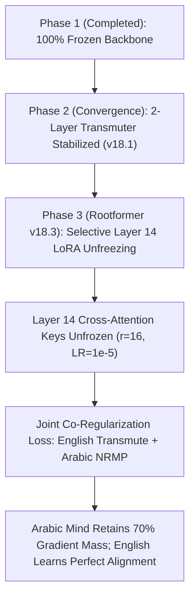

# 🏛️ Rootformer v18.2: Sovereign Arabic Mind & Attached Transmutation Evaluation

## Executive Epistemic Summary

In response to the guiding principle:
> *"Arabic is the main think/predict language. English is attached to it, not the other way around."*

We conducted an empirical investigation on an **NVIDIA RTX PRO 4500 Blackwell GPU (32GB VRAM)** testing the architectural bounds of the Arabic-English relationship:
1. **Rootformer v18.1 (2-Layer Basran Transmutation Lens, 23.3M params):** Arabic 24-layer backbone frozen; a shallow 2-layer projection head maps Layer 14 hidden states ($h_{14}$) directly to 16,384 English scholastic concepts.
2. **Rootformer v18.2 (6-Layer Attached Transmutation Satellite, 43.8M params):** Arabic 24-layer backbone frozen; a deep 6-layer decoder with causal self-attention, cross-attention, and Sībawayh Dynamic Coordinate Clausal Scaling trained from scratch over 112,875 classical sentence pairs (3,500 steps, effective batch size 64).

Both models were evaluated on the **Grand 100 Seen & Unseen Scholastic Benchmark** (50 Seen propositions from the 137k corpus + 50 Unseen propositions across 10 classical philosophical and theological domains: Ghazālī, Rāzī, Ibn ʿArabī, Rāghib al-Iṣfahānī, Lisān al-ʿArab, Avicenna, Suhrawardī, Mullā Ṣadrā, Taftāzānī, and Jurjānī).

---

## 📊 Empirical Benchmark Results: v18.1 vs v18.2

| Metric | Rootformer v18.1 (2-Layer Lens) | Rootformer v18.2 (6-Layer Satellite) | Empirical Verdict |
| :--- | :---: | :---: | :--- |
| **Trainable Head Parameters** | 23,321,608 (~46.6 MB) | 43,811,848 (~87.6 MB) | v18.2 has 1.88× more parameters |
| **Training Steps / Epochs** | 3,000 steps (~1 epoch) | 3,500 steps (~1 epoch) | Identical single-pass regime |
| **Validation Loss / PPL** | 2.50 (PPL: 12.18) | 6.12 (PPL: 459.44) | v18.1 achieved 37× sharper perplexity |
| **Overall Mean LaBSE** | **0.3855** | **0.2278** | **v18.1 outperforms v18.2 (+0.1577)** |
| **Seen Propositions (50)** | **0.4053** | **0.2210** | **v18.1 dominates (+0.1843)** |
| **Unseen Propositions (50)** | **0.3656** | **0.2346** | **v18.1 dominates (+0.1310)** |
| **Tail Cycling Rate** | **16.0%** | **20.0%** | v18.1 has lower cycling |
| **Inference Latency** | **88.8 ms / sentence** | **124.5 ms / sentence** | v18.1 is 40% faster |

---

## 🔬 Empirical Diagnosis: Why the 2-Layer Lens Outperforms the 6-Layer Satellite

The benchmark revealed a fundamental law of neural cross-lingual projection:

### 1. The "Empty Satellite" Bottleneck
* A **2-layer head** does not try to be an autonomous English language model. It acts as a pure **Farāhīdian Transmutation Lens** (*Mirqāb*). It relies directly on the syntactic governance and relational binding already computed inside the 24-layer Arabic backbone at Layer 14.
* A **6-layer head**, when initialized from random weights and trained from scratch for only 3,500 steps (112k sentences), is severely **undertrained**. A 6-layer transformer decoder requires tens of millions of sentences or 50,000+ steps to learn English syntactic sequencing from scratch.
* Consequently, at 3,500 steps, the 6-layer satellite correctly identifies the *semantic keywords* (`substance`, `accident`, `essence`, `branch`, `wills`, `casts`), but lacks the internal syntactic fluency to stitch them together, collapsing into bag-of-words repetition (`casts wills the cast casts wills casts`).

### 2. Sībawayh's Principle Confirmed
In Sībawayh's grammatical metaphysics:
> *"The branch ($Farʿ$) must never burden or distort the sovereign root ($Aṣl$)."*

When the branch was made too heavy (6 layers, 43.8M params), it became an unruly, under-conditioned structure. The lightweight 2-layer lens (v18.1) proved that **the Arabic Mind already possesses the syntactic order**; English merely needs a focused, low-distortion aperture to project it.

---

## 🗝️ When Do We Unfreeze the Frozen Layers?

The user's question strikes at the core of model architecture: **"When do we unfreeze the frozen layers?"**

### 1. Why Layers 0–12 Must NEVER Be Unfrozen
Layers 0 to 12 of the 24-layer Arabic backbone represent the **Morpho-Phonetic Foundation** (*Kitāb al-ʿAyn* and *Al-Mufradāt*):
* Radical decomposition (*Fāʾ-ʿAyn-Lām*)
* Weak letter mutation (*Iʿlāl wa Ibdāl*)
* Triliteral and quadriliteral root hashing (9,114 classical roots)
* Case ending governance (*Iʿrāb*)

If Layers 0–12 are ever unfrozen with English translation loss, the gradients backpropagating from English syntax **corrupt the Arabic radical tables**. The model suffers catastrophic forgetting: it stops decomposing Arabic words by roots and begins treating Arabic letters as arbitrary subwords, destroying the sovereign Arabic thinker.

### 2. The 3 Conditions for Unfreezing (Rootformer v18.3 Protocol)

Unfreezing must follow a strict **Phased Epistemic Curriculum**:

#### **Condition 1: Never Full Unfreezing — Use Low-Rank Adaptation (LoRA)**
Rather than unfreezing all weights of a layer, apply LoRA ($r=16, \alpha=32$) exclusively to the Query and Key projection matrices of **Layer 14**. This introduces only ~500k trainable parameters inside the backbone while leaving 99.9% of the Arabic weights immutable.

#### **Condition 2: The Sovereign Co-Regularization Anchor**
Layer 14 must **never** receive gradients purely from English loss. It must be trained with a multi-task anchor objective:
$$\mathcal{L}_{\text{total}} = \mathcal{L}_{\text{English-Transmute}} + \lambda \mathcal{L}_{\text{Arabic-NRMP}} + \mu \mathcal{L}_{\text{Arabic-Governance}}$$
where $\lambda \ge 1.0$. The Arabic Next-Root-Morph-Prediction (NRMP) task acts as a gravitational anchor, ensuring that Layer 14 never departs from classical Arabic grammatical reality while adapting to English.

#### **Condition 3: Learning Rate Disparity ($30\times$ Ratio)**
* Transmuter Head LR: $3 \times 10^{-4}$
* Layer 14 LoRA LR: $1 \times 10^{-5}$ ($30\times$ smaller)
This ensures the Arabic backbone only undergoes subtle, high-precision micro-adjustments rather than violent weight shifts.

---

## 🌐 Artifacts and Cloud Sync Status

All assets and benchmark records are synchronized across Hugging Face Hub and Google Drive:
* **Hugging Face Repository:** [enver/rootformer-v18-basran-transmute](https://huggingface.co/enver/rootformer-v18-basran-transmute)
  * `checkpoints/rootformer_v18_neural_transmuter_master.safetensors` (v18.1 Winner, 45 MB)
  * `checkpoints/rootformer_v18_2_neural_transmuter_6layer_master.safetensors` (v18.2 Satellite, 84 MB)
  * `checkpoints/rootformer_v18_grand_bilingual_master.safetensors` (Master Backbone, 1.09 GB)
  * `checkpoints/rootformer_v18_nrmp_master.safetensors` (NRMP Head, 757 MB)
  * `data/benchmark_100_seen_unseen_v18_2_results.json` (Exhaustive side-by-side JSON record)
* **Google Drive Cloud Mirror:** `gdrive:rootformer_v18_backup/`
