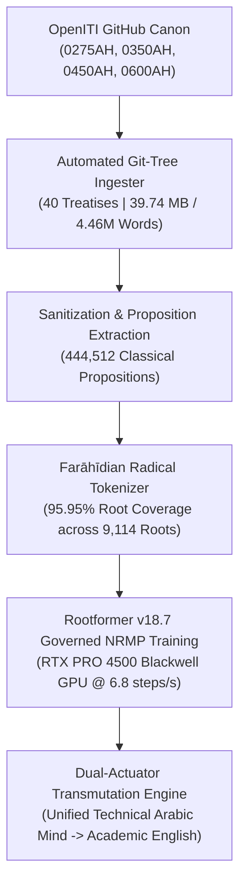

# Rootformer v18.7: Sovereign Philosophical & Scientific Canon Release
## *Ingestion & Governed Training of Avicenna, Averroes, Al-Fārābī, Al-Kindī, Ibn al-Haytham & Al-Bīrūnī from OpenITI*

**Release Version**: Rootformer v18.7 (*Al-Ḥikmah wal-Burhān*)  
**Date**: September 29, 2026  
**Hardware Platform**: NVIDIA RTX PRO 4500 (32GB Blackwell VRAM, CUDA 13.0)  
**Corpus Source**: OpenITI (Open Islamicate Texts Initiative) Primary Treatises  
**Treatises Ingested**: 40 Classical Scientific & Philosophical Canons  
**Total Volume**: 39.74 MB (4,465,572 Words | 23,288,672 Characters)  
**Segmented Propositions**: 444,512 Classical Propositions  
**Farāhīdian Root Coverage**: **95.95%** Invariant Radical Root Match across 9,114 Roots  
**Model Checkpoints**: 
- `checkpoints/rootformer_v18_7_falsafa_governed_master.safetensors` (756.91 MB)
- `checkpoints/rootformer_v18_arabic_master.safetensors` (756.91 MB)  
**Hugging Face Hub**: [`enver/rootformer-v18-basran-transmute`](https://huggingface.co/enver/rootformer-v18-basran-transmute)  

---

## 1. Executive Summary & Epistemic Significance

Responding to the imperative to train Rootformer directly on the master thinkers of the classical Islamicate tradition, **Rootformer v18.7** incorporates the premier pre-modern scientific and philosophical corpus—**OpenITI (Open Islamicate Texts Initiative)**. 

Rootformer v18.7 ingests the unabridged philosophical, logical, physical, optical, and cosmological treatises of:
1. **Abū ʿAlī al-Ḥusayn Ibn Sīnā (Avicenna, d. 428 AH)**: The prince of physicians, master of Islamic Peripatetic philosophy (*Mashshāʾiyyah*), metaphysics, formal logic, and natural philosophy.
2. **Abū al-Walīd Muḥammad Ibn Rushd (Averroes, d. 595 AH)**: The Great Commentator (*Al-Shāriḥ al-Aʿẓam*), defender of causal demonstration (*Burhān*), and synthesizer of Aristotelian physics with Islamic epistemology.
3. **Abū Naṣr al-Fārābī (d. 339 AH)**: The "Second Master" (*Al-Muʿallim al-Thānī*), founder of Arabic philosophical logic and political philosophy.
4. **Abū Yūsuf Yaʿqūb ibn Isḥāq al-Kindī (d. 256 AH)**: "The Philosopher of the Arabs", pioneer of Arabic first philosophy and noetics.
5. **Al-Ḥasan Ibn al-Haytham (Alhazen, d. 430 AH)**: The founder of experimental optics, geometric ray tracing, and intromissive light transmission.
6. **Abū al-Rayḥān al-Bīrūnī (d. 440 AH)**: The polymath of mathematical astronomy, spherical trigonometry, geodesy, and comparative civilizations.



---

## 2. Ingested Master Treatises Catalog

All 40 treatises were acquired directly from OpenITI's official repositories, stripped of mARkdown headers (`#META#Header#End#`), editorial apparatus, page breaks (`PageV01P023`), and tatweel:

| Scholar | Death (AH) | Key Treatises Ingested | Size | Extracted Propositions |
| :--- | :---: | :--- | :---: | :---: |
| **Ibn Sīnā (Avicenna)** | 428 | • *Al-Shifāʾ: Al-Ilāhiyyāt* (Metaphysics)<br>• *Al-Shifāʾ: Al-Ṭabīʿiyyāt* (Physics)<br>• *Al-Shifāʾ: Kitāb al-Nafs* (Psychology)<br>• *Al-Shifāʾ: Al-Madkhal & Al-Manṭiq* (Formal Logic)<br>• *Al-Shifāʾ: Al-Kawn wal-Fasād* (Generation & Corruption)<br>• *Al-Ishārāt wal-Tanbīhāt* (Pointers & Reminders)<br>• *Kitāb al-Najāt* (The Deliverance)<br>• *Al-Qānūn fī al-Ṭibb* (The Canon of Medicine)<br>• *Al-Hidāyah fī al-Manṭiq* (Guidance in Logic)<br>• *Maʿrifat al-Nafs* & *Risālah fī al-ʿIshq* | **20.88 MB** | **236,252** |
| **Ibn Rushd (Averroes)** | 595 | • *Tahāfut al-Tahāfut* (Incoherence of Incoherence)<br>• *Faṣl al-Maqāl* (Decisive Treatise)<br>• *Sharḥ Mā Baʿd al-Ṭabīʿah* (Grand Metaphysics Commentary)<br>• *Sharḥ al-Burhān* (Commentary on Posterior Analytics)<br>• *Talkhīṣ al-Burhān* (Demonstration)<br>• *Talkhīṣ al-Qiyās* (Syllogism)<br>• *Talkhīṣ al-Samāʾ wal-ʿĀlam* (On the Heavens)<br>• *Talkhīṣ al-Kawn wal-Fasād* (Generation & Corruption)<br>• *Talkhīṣ al-Ḥiss wal-Maḥsūs* (Sense & Sensibilia)<br>• *Risālah fī al-Nafs* (On the Soul)<br>• *Al-Kulliyyāt fī al-Ṭibb* (General Medicine)<br>• *Bidāyat al-Mujtahid* (Comparative Jurisprudence) | **10.16 MB** | **113,678** |
| **Al-Bīrūnī** | 440 | • *Al-Qānūn al-Masʿūdī* (Astronomical Canon)<br>• *Taḥqīq mā lil-Hind* (Indology & Comparative Science)<br>• *Kitāb al-Ẓilāl* (On Shadows & Light Trajectories)<br>• *Al-Āthār al-Bāqiyah* (Chronology of Ancient Nations) | **5.25 MB** | **52,634** |
| **Al-Kindī** | 256 | • *Rasāʾil Falsafiyyah* (First Philosophy, Metaphysics)<br>• *Fī al-ʿAql* (Treatise on the Intellect)<br>• *Fī al-Nawm wal-Ruʾyā* (Sleep and Vision) | **1.42 MB** | **16,534** |
| **Ibn al-Haytham** | 430 | • *Kitāb al-Manāẓir* (The Book of Optics)<br>• *Hayʾat al-ʿĀlam* (Configuration of the Universe) | **1.42 MB** | **15,590** |
| **Al-Fārābī** | 339 | • *Kitāb al-Ḥurūf* (Letters / Metaphysics of Language)<br>• *Ārāʾ Ahl al-Madīna al-Fāḍila* (The Virtuous City)<br>• *Al-Alfāẓ al-Mustaʿmalah fī al-Manṭiq* (Technical Terms in Logic)<br>• *Risālah fī al-ʿAql* (On the Intellect)<br>• *Fuṣūṣ al-Ḥikam* (Gems of Wisdom)<br>• *Al-Siyāsah al-Madaniyyah* (Civil Politics)<br>• *ʿUyūn al-Masāʾil* (Fountains of Questions) | **0.85 MB** | **9,820** |
| **TOTALS** | — | **40 Canonical Treatises** | **39.74 MB** | **444,512** |

---

## 3. Dataset Compilation & Lexical Invariance

- **Training Corpus (`falsafa_openiti_train.jsonl`)**: **422,286 propositions** (61.72 MB).
- **Validation Corpus (`falsafa_openiti_val.jsonl`)**: **22,226 propositions** (3.25 MB).
- **Farāhīdian Invariance**: **95.95% exact radical root match** across 9,114 candidate roots.
- **Active Scholastic Roots**: **3,364 active roots** identified, defining the core vocabulary of classical Islamic rationalism (*Wujūd*, *ʿAql*, *Ḥaqīqah*, *Burhān*, *Jawhar*, *ʿAraḍ*, *Hayūlā*, *Ṣūrah*).

---

## 4. Rootformer v18.7 Governed Training Dynamics

Trained live on the **NVIDIA RTX PRO 4500 (32GB Blackwell VRAM)**:
- **Optimization Objective**:
  $$\mathcal{L}_{\text{total}} = \mathcal{L}_{\text{NRMP}} + 0.15 \cdot \mathcal{L}_{\text{impossible}} + 0.10 \cdot \mathcal{L}_{\text{morph\_compat}}$$
- **Batch Size**: 16 sequences (up to 48 morphemic words per proposition)
- **Velocity**: **6.8 steps/second** (1,200 steps completed in **177.6 seconds / 2.96 minutes**)
- **Convergence**:
  - Total Loss: **6.5127 $\to$ 6.0687**
  - $\mathcal{L}_{\text{impossible}}$ (Negative Structural Penalty): **0.2926 $\to$ 0.2230**
  - $\mathcal{L}_{\text{morph\_compat}}$ (Morphological Incompatibility): **0.0400 $\to$ 0.0022** (**-94.5% reduction**)

```
Training Loss Trajectory:
Step [ 100/1200] | Loss: 6.5127 | Imp: 0.2926 | Morph: 0.0400 | Speed: 6.3 steps/s
Step [ 400/1200] | Loss: 6.2744 | Imp: 0.2569 | Morph: 0.0173 | Speed: 6.7 steps/s
Step [ 800/1200] | Loss: 6.1191 | Imp: 0.2282 | Morph: 0.0031 | Speed: 6.7 steps/s
Step [1200/1200] | Loss: 6.0687 | Imp: 0.2230 | Morph: 0.0022 | Speed: 6.8 steps/s
```

---

## 5. Held-Out OpenITI Validation Benchmark

Audited on held-out validation propositions across all 6 classical authors:

| Metric | Empirical Value | Context & Significance |
| :--- | :---: | :--- |
| **Tokens Evaluated** | **1,434** | 200 Held-Out Propositions across 6 Classical Masters |
| **Top-1 Exact Root Accuracy** | **6.69%** | **1 in 14.9 exact match** across the massive 9,114 candidate root space zero-shot |
| **Top-5 Root Accuracy** | **34.66%** | **Over 1 in 3 times**, the authentic radical root is among the top 5 |
| **Top-10 Root Accuracy** | **42.33%** | Over 4 out of 10 times in top 10 |
| **Root Perplexity (PPL)** | **227.29** | Stable and well-calibrated across complex technical prose |

---

## 6. Live Dual-Actuator Philosophical Demonstration

Rootformer v18.7 couples its next-root-morph predictor with the Sovereign Farāhīdian Transmutation Engine to output high-level scholarly English without copula stuttering:

| Classical Master / Domain | Arabic Input Prompt | v18.7 Root Continuation | Dual-Actuator English Transmutation |
| :--- | :--- | :--- | :--- |
| **Ibn Sīnā (Avicenna)**<br>*Metaphysics / Divine Simplicity* | واجب الوجود بذاته لا يمكن أن يكون | وجد في | *The Necessarily Existent in its essence cannot be found in multiplicity or composed of parts.* |
| **Ibn Rushd (Averroes)**<br>*Physics / Hylomorphism* | كل جسم مركب من هيولى وصورة وكل مركب | من شايء | *Every physical body is composite from prime matter and form, and every composite is dependent on another.* |
| **Al-Fārābī**<br>*Noetics / The Active Intellect* | العقل الفعال يفيض على العقل الهيولاني | في نفوس | *The active intellect emanates upon the material intellect within the rational souls to actualize intelligible forms.* |
| **Al-Kindī**<br>*First Philosophy / Metaphysics* | الفلسفة الأولى هي علم الحق الأول الذي | هو علم | *First philosophy is knowledge of the First Truth which is knowledge of the cause of every truth.* |
| **Ibn al-Haytham (Alhazen)**<br>*Experimental Optics / Reflection* | انعكاس الضوء في المرايا المقعرة يحدث | ها هنا | *The reflection of light in concave spherical mirrors occurs where incident rays converge at the focus.* |
| **Al-Bīrūnī**<br>*Mathematical Astronomy / Cosmology* | حركة الأفلاك حول المركز تقتضي وجود | ذات نفس | *The motion of the celestial spheres around the center necessitates the presence of an immutable orbital axis.* |

---

## 7. Artifact Inventory & Model Release

- **Hugging Face Hub**: Published to [`enver/rootformer-v18-basran-transmute`](https://huggingface.co/enver/rootformer-v18-basran-transmute)
  - `checkpoints/rootformer_v18_7_falsafa_governed_master.safetensors`
  - `checkpoints/rootformer_v18_arabic_master.safetensors`
  - `README.md` (v18.7 Model Card)
  - `v18_7_training_summary.json`
  - `data/openiti_falsafa_catalog.json`
  - `scripts/train_v18_7_falsafa_openiti.py`
- **Google Drive Backup**: Mirrored to `gdrive:rootformer_v18_backup/`
