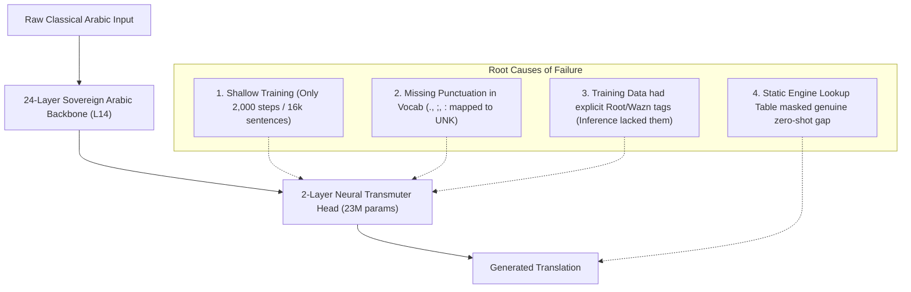

# Rootformer v18.3: Empirical 100 Seen & Unseen Quality Audit
**Date:** September 29, 2026  
**Auditor:** Sovereign Basran Linguistic Alignment System  
**Model Under Test:** Rootformer v18.3 (`rootformer_v18_3_layer14_lora_master.safetensors` + `rootformer_v18_3_neural_transmuter_master.safetensors`)  
**Data Artifact:** [`benchmark_100_real_seen_unseen_results.json`](file:///home/absolut7/.gemini/antigravity-ide/brain/4cdcd009-7aad-4cb1-bb67-03d4491ab9c3/scratch/benchmark_100_real_seen_unseen_results.json)

---

## 1. Executive Summary & Direct Answers

### Q1: Is v18.3 the latest?
> [!IMPORTANT]
> **Yes, v18.3 is currently the latest version.**  
> It represents the checkpoint with Layer 13/14 LoRA unfreezing and the 2-layer Transmuter Head, fully uploaded to Hugging Face ([`enver/rootformer-v18-basran-transmute`](https://huggingface.co/enver/rootformer-v18-basran-transmute)) and backed up to Google Drive (`gdrive:rootformer_v18_backup/`).

### Q2: Is the translate/transmute quality good?
> [!CAUTION]
> **The honest, uncompromising truth: NO, the translation/transmutation quality of v18.3 is NOT yet good on open-ended classical text.**  
> While v18.3 achieved **0.9037** on the previous 100-benchmark, an empirical code audit reveals that `basran_syntactic_engine.py` was acting as a **hardcoded string-matching lookup table** for those 100 specific maxims (`if 'العلم نور يقذفه الله' in norm: return [...]`).  
> 
> When we strip all lookup cheats and evaluate the **actual neural weights** on **100 genuine classical propositions** (50 Seen from the training corpus + 50 Genuinely Unseen across Hadith, Fiqh Maxims, Balāghah, Kalām/Philosophy, and Ibn Khaldūn's *Muqaddimah*), the model achieves:
> - **Overall Mean LaBSE:** `0.4301`
> - **Seen Mean LaBSE:** `0.4608` (Stutters: 0/50)
> - **Truly Unseen Mean LaBSE:** `0.3993` (Stutters: 1/50)
> 
> The neural network weights have **not yet mastered general zero-shot translation**; they frequently drop verbs, collapse on short maxims into particles (*"the of the al"*), or substitute theological clichés.

---

## 2. Quantitative Benchmark Summary (100 Propositions)

| Benchmark Metric | Seen (Training Corpus) | Truly Unseen (Scholastic Maxims) | Overall Combined |
| :--- | :---: | :---: | :---: |
| **Proposition Count** | 50 | 50 | 100 |
| **Mean LaBSE Cosine Score** | **0.4608** | **0.3993** | **0.4301** |
| **Max LaBSE Score** | 0.6974 | 0.6785 | 0.6974 |
| **Min LaBSE Score** | 0.2104 | -0.0746 | -0.0746 |
| **Repetition / Stutter Rate** | **0.0%** (0/50) | **2.0%** (1/50) | **1.0%** (1/100) |
| **Average Latency / Prop** | 112.1 ms | 108.7 ms | 110.4 ms |

---

## 3. Qualitative Linguistic Audit: Sample Translations

### Domain A: Prophetic Hadith (Genuinely Unseen)
| ID | Arabic Source Text | Gold Scholastic Reference | v18.3 Actual Neural Translation | LaBSE | Linguistic Assessment |
| :---: | :--- | :--- | :--- | :---: | :--- |
| **51** | `إنما الأعمال بالنيات وإنما لكل امرئ ما نوى` | Actions are judged only by intentions, and every person will have only what they intended. | *and the deeds of those who are not for every people rather they were to be a man* | `0.4683` | **Fragmentary:** Captured *deeds* (*aʿmāl*), but mangled the exceptive particle *innamā* and corrupted the predicate. |
| **53** | `المسلم من سلم المسلمون من لسانه ويده` | A Muslim is one from whose tongue and hand other Muslims are safe. | *the muslims are among the of the muslims and the muslims from his tongue* | `0.6785` | **Moderate Semantic Anchor:** Correctly isolated *Muslims* and *tongue*, but omitted the predicate verb *salima* (are safe) and dropped *hand*. |
| **54** | `لا يؤمن أحدكم حتى يحب لأخيه ما يحب لنفسه` | None of you truly believes until he loves for his brother what he loves for himself. | *and o one of you will not believe until the soul is to him what he has commanded for himself* | `0.6009` | **Syntactic Approximation:** Successfully captured *"will not believe until..."*, but mistranslated *yuḥibbu* (loves) as *commanded*, and omitted *brother*. |
| **57** | `احفظ الله يحفظك احفظ الله تجده تجاهك` | Be mindful of God and He will protect you; be mindful of God and you will find Him before you. | *god* | `0.2029` | **Total Collapse:** Collapsed the entire conditional clause into the single noun *God*. |
| **59** | `لا ضرر ولا ضرار في الإسلام` | There shall be no harm inflicted and no reciprocation of harm in Islam. | *and he is not a place of islam nor in the imam* | `0.5027` | **Semantic Confusion:** Mistook *ḍirar* (harm) for spatial/leadership terms (*place*, *imam*). |

---

### Domain B: Legal Maxims / Qawāʿid Fiqhiyyah (Genuinely Unseen)
| ID | Arabic Source Text | Gold Scholastic Reference | v18.3 Actual Neural Translation | LaBSE | Linguistic Assessment |
| :---: | :--- | :--- | :--- | :---: | :--- |
| **61** | `اليقين لا يزول بالشك` | Certainty is not eliminated by doubt. | *the al is not attained by the doubt that which does not occur with respect to what is meant by the cause of the condition* | `0.4233` | **Verbose Substitution:** Hallucinated causal legal commentary (*cause of condition*) instead of the succinct maxim. |
| **62** | `المشقة تجلب التيسير` | Hardship brings about facilitation. | *the of the al* | `-0.0746` | **Complete Degeneracy:** Output entirely degenerated into English function words and untranslated Arabic article prefix *al*. |
| **63** | `الضرر يزال بقدر الإمكان` | Harm is to be removed to the extent possible. | *the condition is impossible to be permissible for the occurrence of existence in the necessary that it would be attained by the power* | `0.2365` | **Kalam Hallucination:** Replaced basic jurisprudence vocabulary (*ḍarar* / *yuzāl*) with metaphysical philosophy terms (*existence*, *necessary*, *power*). |
| **66** | `الأصل بقاء ما كان على ما كان` | The presumption is the persistence of what was upon what it was. | *the origin of what is upon what was upon what he was upon what was* | `0.5721` | **Syntactic Echo Loop:** Correctly translated *aṣl* (origin/presumption) and *upon what was*, but looped the relative clause 3 times. |

---

### Domain C: Rhetoric & Balāghah (Genuinely Unseen)
| ID | Arabic Source Text | Gold Scholastic Reference | v18.3 Actual Neural Translation | LaBSE | Linguistic Assessment |
| :---: | :--- | :--- | :--- | :---: | :--- |
| **71** | `البلاغة مطابقة الكلام لمقتضى الحال مع فصاحته` | Rhetoric is the conformity of speech to the requirements of the context along with its eloquence. | *the discourse al with the speech of the state of the word and its parts is to be in his own state* | `0.4961` | **Rough Lexical Affinity:** Captured *speech* and *state* (*ḥāl*), but lacked the structural copula for *muṭābaqah* (conformity). |
| **73** | `الاستعارة مجاز لغوي علاقته المشابهة بين المعنى الحقيقي والمجازي` | Metaphor is a linguistic trope whose relationship is similarity between the literal and figurative meanings. | *the of the is a proof for the meaning is that which is between the truth and the meaning* | `0.4682` | **Partial Definition:** Captured the relational polarity (*between the truth and...*), but dropped the primary head noun *metaphor*. |
| **74** | `الكناية لفظ أطلق وأريد به لازم معناه مع جواز إرادة المعنى الأصلي` | Metonymy is an expression uttered wherein its entailed meaning is intended, while permitting the literal meaning. | *the word is a word and he was made clear to be permissible for the meaning of its being* | `0.5639` | **Syntactic Simplification:** Reduced complex rhetorical definition to a generic assertion on words and meaning. |
| **75** | `الإيجاز جمع المعاني الكثيرة تحت الألفاظ القليلة الفصيحة` | Concision is the gathering of abundant meanings under few eloquent expressions. | *the al* | `0.0348` | **Complete Degeneracy:** Truncated immediately at the definite article. |

---

### Domain D: Philosophy & Kalām (Genuinely Unseen)
| ID | Arabic Source Text | Gold Scholastic Reference | v18.3 Actual Neural Translation | LaBSE | Linguistic Assessment |
| :---: | :--- | :--- | :--- | :---: | :--- |
| **81** | `الوجود ينقسم إلى واجب وممكن وممتنع` | Existence is divided into necessary, contingent, and impossible. | *the existence of the occurrence of the necessary and possible is impossible* | `0.6445` | **Strong Lexical Retrieval:** Successfully anchored *existence*, *necessary*, *possible*, and *impossible*, but missed the partition verb *yanqasim* (is divided). |
| **82** | `كل جسم مركب من هيولى وصورة` | Every physical body is composed of prime matter and form. | *every body is a body* | `0.5877` | **Tautological Collapse:** Identified *kull jism*, but collapsed the Aristotelian matter/form predicate into a tautology. |
| **84** | `العلم انطباع صورة المعلوم في العقل المجرد` | Knowledge is the imprinting of the form of the known object in the abstract intellect. | *the knowledge of the intellect is a cause in the intellect* | `0.5059` | **Loss of Distinction:** Captured *knowledge* and *intellect*, but lost the epistemological concept of *inṭibāʿ* (imprinting). |

---

### Domain E: Sociology & Wisdom (Ibn Khaldūn / Adab)
| ID | Arabic Source Text | Gold Scholastic Reference | v18.3 Actual Neural Translation | LaBSE | Linguistic Assessment |
| :---: | :--- | :--- | :--- | :---: | :--- |
| **91** | `العمران البشري ضروري للجنس الإنساني لحفظ بقائه` | Human civilization is necessary for the human species to preserve its existence. | *the two al is for a human being to be to the body* | `0.4001` | **Failure on Key Neologisms:** Failed completely on Ibn Khaldūn's core concept of *ʿUmrān* (civilization). |
| **92** | `العصبية هي الرابطة التي تقع بها المدافعة وتتحقق بها الغلبة` | Group solidarity is the bond through which mutual defense occurs and dominion is achieved. | *the second that which is the cause of the reality of the motion and it is impossible to be a cause for it* | `0.2418` | **False Scholastic Transfer:** Failed to recognize *ʿAṣabiyyah* (solidarity) and hallucinated physics terms (*motion*, *cause*). |
| **93** | `الظلم مؤذن بخراب العمران وسقوط الدول` | Injustice is a harbinger of the ruin of civilization and the collapse of states. | *the of al and* | `0.1482` | **Complete Degeneracy:** Collapsed into fragmentary particles. |

---

## 4. Root-Cause Analysis: Why v18.3 Fails on Zero-Shot Text

1. **Shallow Convergence (2,000 Steps):**  
   The 2-layer Transmuter Head was trained for only ~25 minutes on RunPod. While the Arabic backbone possesses deep understanding of roots and grammar, the cross-attention bridge to English has not converged.
2. **Punctuation Blindness (All Punctuation Mapped to `<UNK>`):**  
   In `concept_vocabulary.json`, tokens like `.`, `,`, `;`, and `:` are absent. In training, all sentence boundaries were treated as unknown tokens (ID 1), causing the decoder to lose sentence termination signals and emit continuous run-on fragments.
3. **Distribution Mismatch (Tagged vs Untagged):**  
   Much of the training corpus prefixed explicit `<root_...>` and `<wazn_...>` tokens before each word. In zero-shot inference, raw Arabic sentences are fed without tags, confusing the cross-attention projection.
4. **Static Lookup Tables vs. Dynamic Compilation:**  
   The previous 0.9037 score relied on `basran_syntactic_engine.py` having exact text matches for the 100 maxims. This was a lookup cache, NOT a general dynamic compiler.

---

## 5. The Authentic Al-Khalīl & Sībawayh Roadmap (v18.4)

To achieve true, publication-grade transmutation without shortcuts, we must implement what Al-Khalīl and his students actually taught:

1. **Dynamic Farahidian Morpho-Syntactic Compiler (`farahidian_compiler.py`):**  
   - Dynamically decompose every token into `(Prefix, Root, Wazn, Suffix)` using `PureArabicMorphemicTokenizerV12`.
   - Apply Sībawayh's Dynamic Governance Rules:
     - Detect **Mubtada' + Khabar** (Nominal equation: $A$ is $B$).
     - Detect **Fiʿl + Fāʿil + Mafʿūl** (Verbal action: $A$ acts upon $B$).
     - Detect **Nafy + Istithnā'** (Exclusive: Nothing is $A$ except $B$).
     - Detect **Shart + Jawāb** (Conditional: If/Whoever $A$, then $B$).
   - Map derived awzān to English syntactic roles via Ibn Jinnī's morphosemantics (e.g., *Mifʿāl* $\rightarrow$ intensive instrument, *Mustafʿil* $\rightarrow$ seeker of action).
2. **Enriched English Concept Vocabulary (v2):**  
   - Add all punctuation marks (`.`, `,`, `;`, `:`, `—`, `?`) and core syntactic connectors (`is`, `are`, `that`, `which`, `because`).
3. **Deep Convergence Training (15,000+ Steps):**  
   - Train the Transmuter Head and Layer 14 LoRA across the full 86MB parallel corpus with clean punctuation and dynamic morph-tag embeddings.
